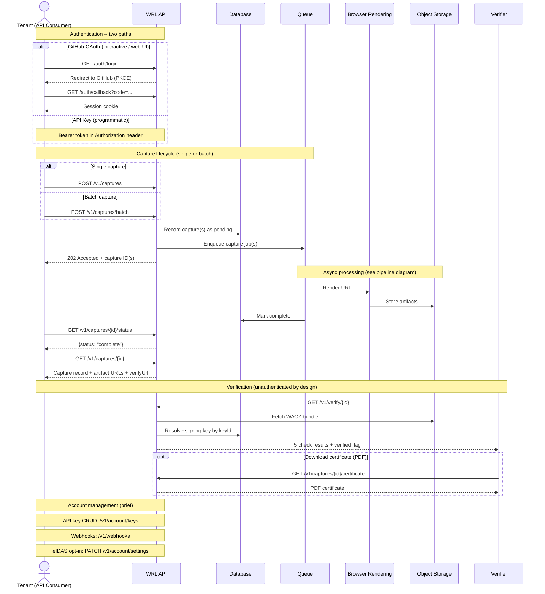
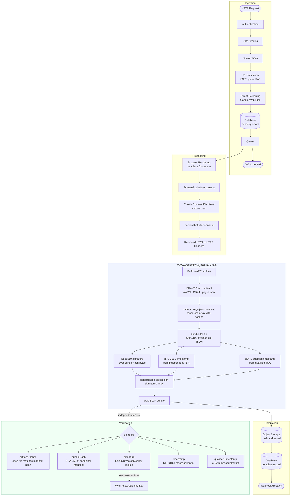

# Architecture

This page explains how WRL works under the hood -- the flows a tenant API consumer sees, and the internal pipeline that produces tamper-evident captures. It is aimed at technical evaluators who want to understand the system before integrating or before presenting captures as evidence.

## User Interaction Flows

The sequence diagram below shows the four interaction patterns available to API consumers: authenticating (via GitHub OAuth or API key), submitting captures (single or batch), polling for results, and verifying a completed capture.

The verify endpoint is intentionally unauthenticated -- any third party can verify a capture without an account. The verification decision is driven by five independent checks run against the WACZ bundle itself (see [Verification](/verification/) for details). Signing key resolution uses the server's authoritative key store via `/.well-known/signing-key(s)`, not the key embedded in the bundle.

## Capture Pipeline & Integrity Chain

The flowchart below traces a single capture from HTTP ingestion through browser rendering to the final signed WACZ bundle in storage.

The diagram highlights two design decisions that matter for trust.

**The integrity chain.** Every artifact file is hashed individually. Those hashes go into `datapackage.json`. The canonical JSON of that manifest is hashed to produce `bundleHash`. Then `bundleHash` is signed and timestamped. All three attestations (Ed25519 signature, RFC 3161 timestamp, and optional eIDAS qualified timestamp) cover the same `bundleHash` -- they are siblings in the `signatures` array, not a sequential chain. Any modification to any artifact at any level breaks the `bundleHash` and invalidates all attestations at once.

**Key resolution.** Verification uses the server's current public key (fetched from `/.well-known/signing-key`) to verify the signature. The public key embedded in the WACZ bundle is informational only and is never trusted for the verification decision. Historical keys remain available at `/.well-known/signing-keys` so that captures signed under a rotated key continue to verify indefinitely.

eIDAS qualified timestamps

RFC 3161 timestamps are included in every capture by default. The eIDAS qualified timestamp is opt-in and can be enabled account-wide via `PATCH /v1/account/settings`. When enabled, the capture pipeline requests a second timestamp from a qualified trust service provider in addition to the standard RFC 3161 timestamp. Both timestamps cover the same `bundleHash`, so both are independently verifiable. The qualified timestamp carries the legal weight of a qualified electronic timestamp under eIDAS Article 41 and is relevant for evidence in EU legal proceedings. See [Legal Evidence](/legal-evidence/) for how this maps to specific legal standards.

---

For detailed endpoint documentation see [API Reference](/api-reference/). For how these properties map to legal authentication standards see [Legal Evidence](/legal-evidence/). For the full verification protocol see [Verification](/verification/). For security architecture and threat model see [Security & Compliance](/security/).
