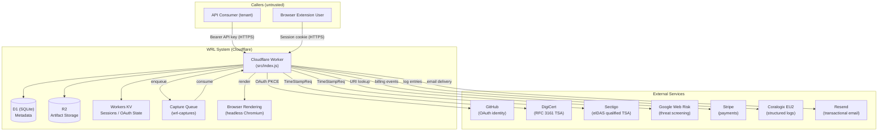
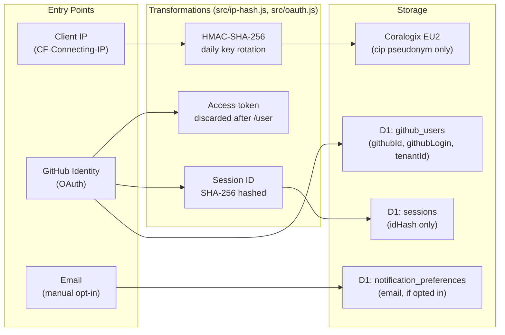
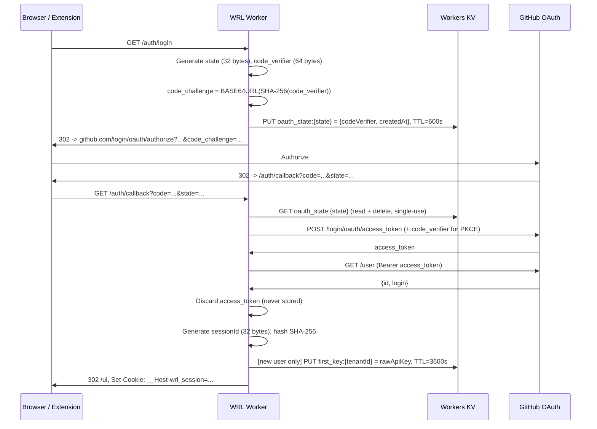

# Security Whitepaper

*Web Resource Ledger — last reviewed 2026-03-25*

---

## 1. Executive Summary

Web Resource Ledger (WRL) is a web capture service that produces cryptographically signed, independently verifiable records of web page content. Captures are stored as WACZ bundles (Web Archive Collection Zipped) and can be verified by any party without contacting WRL.

WRL runs entirely on Cloudflare's serverless infrastructure. There is no WRL-operated server, no WRL-managed database cluster, and no WRL-controlled encryption key material beyond the Ed25519 signing key and session HMAC secret stored as Cloudflare Worker secrets. All compute, storage, and network are Cloudflare services.

**Key security properties:**

- **Ed25519 signing** — every WACZ bundle is signed with an Ed25519 private key. The corresponding public key is published at `GET /.well-known/signing-key`. A valid signature proves the bundle was produced by the WRL operator and has not been modified since (see `src/signing.js`).
- **RFC 3161 timestamps** — every capture receives a standard timestamp from DigiCert's TSA (`https://timestamp.digicert.com`). Tenants who have opted in to eIDAS-qualified timestamps additionally receive a qualified timestamp from Sectigo (`https://timestamp.sectigo.com/qualified`). Timestamps are cryptographically bound to the bundle hash and cannot be transferred or backdated (see `src/rfc3161.js`).
- **IP pseudonymization** — client IP addresses are never stored in plaintext. A two-step HMAC-SHA-256 derivation produces a daily-rotating pseudonym (`cip`) used in logs for abuse correlation. The derivation resets every 24 hours; cross-day correlation is not possible from logs alone (see `src/ip-hash.js`).
- **SSRF prevention** — all caller-supplied URLs are validated against a comprehensive private IP blocklist before being passed to Browser Rendering. The blocklist covers RFC 1918, link-local, CGNAT, loopback, and all IPv4 encoding variants (see `src/url-validation.js`).
- **API key authentication with timing-safe comparison** — API keys are stored as SHA-256 hashes in D1. Key comparison uses `crypto.subtle.timingSafeEqual`. Raw keys are never logged or stored after creation (see `src/auth.js`).

WRL is operated as a sole-proprietor service. There is no operations team, no 24/7 SOC, and no dedicated security staff. Incident detection relies on nine Coralogix alert rules with email notification. This constraint is disclosed in Section 12.

---

## 2. Architecture Overview

WRL is a Cloudflare-native system. All components run in Cloudflare's network. External dependencies are contacted only for specific bounded operations (OAuth, timestamping, threat screening, payments, email).



**Trust model:** The Worker is the sole trust boundary enforcer. Every request is authenticated and authorized before touching D1, R2, or KV. External services are contacted over TLS with per-service API keys stored as Cloudflare Worker secrets. No service has access to another service's credentials.

**Capture pipeline:** A `POST /v1/captures` request is authenticated, validated, and enqueued. The queue consumer calls `performCapture()` in `src/capture.js`, which opens a fresh `BrowserContext` in headless Chromium, captures screenshots, rendered HTML, and HTTP headers, builds a WACZ bundle, signs it with Ed25519, obtains an RFC 3161 timestamp, and writes artifacts to R2. The `BrowserContext` is closed in a `try/finally` block, discarding all cookies, local storage, and session storage.

---

## 3. Data Classification and Handling

### 3.1 Personal Data

| Data element | Legal basis | Entry point | Transformation | Storage |
|---|---|---|---|---|
| IP address | Legitimate interest (abuse prevention) | `CF-Connecting-IP` header | HMAC-SHA-256 pseudonymization (daily rotation) → `cip` | Coralogix logs only; raw IP never stored |
| GitHub user ID | Contract performance | OAuth callback | Stored as integer after OAuth verification | D1 `github_users` table |
| GitHub username | Contract performance | OAuth callback | Stored as string after OAuth verification | D1 `github_users` table |
| Email address | Consent (notification opt-in) | GitHub OAuth or manual entry | Stored only if user enables notifications | D1 `notification_preferences` table |
| Session ID | Contract performance | Generated at login | SHA-256 hashed before storage; raw ID in HMAC-signed cookie | D1 `sessions` table (hash only) |
| GitHub access token | N/A | OAuth token exchange | Used once to fetch identity; never stored or logged | Discarded after `/user` fetch (see `src/oauth.js`) |

### 3.2 Operational Data

| Data element | Storage | Retention |
|---|---|---|
| Captured URL | D1 `captures` table, R2 artifact path | Per tenant data retention policy |
| WACZ bundle | R2 (`wrl-captures`) | Per tenant data retention policy |
| Ed25519 signature | R2 (embedded in WACZ), D1 (wacz column) | Same as WACZ bundle |
| RFC 3161 timestamp token | R2 (embedded in WACZ), D1 | Same as WACZ bundle |
| SHA-256 artifact hashes | D1 `captures.artifacts` (JSON), WACZ manifest | Same as WACZ bundle |
| API key hash | D1 `api_keys` table | Until key deletion |
| Structured logs | Coralogix EU2 | Per Coralogix retention setting |

### 3.3 Personal Data Flow



**What is never logged:** Raw API keys, raw session cookie values, OAuth authorization codes, OAuth state parameters, raw IP addresses, email addresses, GitHub access tokens, `Authorization` header values. The NEVER LOG contract is documented in `src/log.js`.

---

## 4. Authentication and Access Control

### 4.1 Authentication Methods

WRL supports three authentication methods. They are mutually exclusive per request path.

**API key (tenant API access)**
Callers present a Bearer token in the `Authorization` header. The Worker hashes the token with SHA-256 and performs a D1 lookup against the `api_keys` table. Comparison is hash-based — the raw key is never compared in memory against stored values (see `src/auth.js`). Revoked keys are hard-rejected and do not fall through to the legacy single-key path. D1 I/O failures return HTTP 500 rather than degrading to legacy auth.

**GitHub OAuth PKCE (browser UI / browser extension)**
Users authenticate via GitHub's OAuth 2.0 flow with PKCE (`code_challenge_method=S256`). The PKCE `code_verifier` (64 bytes of entropy, base64url) and CSRF state parameter (32 bytes of entropy) are stored in Workers KV with a 600-second TTL. The state is consumed and deleted on first use (single-use). GitHub access tokens are used once to fetch user identity and then discarded — they are never stored or logged (see `src/oauth.js`). Sessions are created in D1 with the session ID stored as a SHA-256 hash. The raw session ID is signed with HMAC-SHA-256 and placed in a `__Host-wrl_session` cookie.

**Admin key (infrastructure operations)**
Admin endpoints (`/v1/admin/*`) require a separate `ADMIN_KEY` secret. This key is compared with `crypto.subtle.timingSafeEqual`. It does not appear in D1, does not grant capture or read scope, and is never logged (see `src/auth.js` `verifyAdminKey()`).

### 4.2 Scope Model

| Scope | Endpoints | Notes |
|---|---|---|
| `capture` | `POST /v1/captures`, batch, webhooks | Implies `read` |
| `read` | `GET /v1/captures`, artifact retrieval | Read-only |
| `admin` | `/v1/admin/*` | Requires separate admin key credential |

Scope enforcement is performed server-side on every authenticated request via `hasScope()` in `src/auth.js`. Client-supplied scope claims are not accepted.

### 4.3 Session Security

Session cookies are named `__Host-wrl_session`. The `__Host-` prefix is a browser-enforced security invariant that requires the `Secure` flag, prohibits a `Domain` attribute, and mandates `Path=/`. The full cookie attributes are:

```
__Host-wrl_session={sessionId}.{hmacHex}; Secure; HttpOnly; SameSite=Lax; Path=/; Max-Age=604800
```

- `HttpOnly` prevents JavaScript access.
- `Secure` restricts transmission to HTTPS.
- `SameSite=Lax` mitigates CSRF for cross-site navigations.
- `Max-Age=604800` sets a 7-day lifetime.
- The session ID is HMAC-SHA-256 signed with `SESSION_SECRET`. Signature verification uses `crypto.subtle.verify` (timing-safe). See `src/session.js`.

### 4.4 Rate Limiting

Six Cloudflare rate limit bindings are declared in `wrangler.toml`. These are infrastructure-level ceilings; application-level limits may be more restrictive.

| Binding | Purpose |
|---|---|
| `CAPTURE_RATE_LIMITER` | Per-tenant capture submission ceiling |
| `VERIFY_RATE_LIMITER` | Per-tenant verification endpoint |
| `GLOBAL_CAPTURE_LIMITER` | Global capture submission across all tenants |
| `ADMIN_RATE_LIMITER` | Admin API operations |
| `CAPTURE_IP_GUARD` | Per-IP capture submission |
| `AUTH_RATE_LIMITER` | Authentication failures |

### 4.5 OAuth PKCE Flow



---

## 5. Encryption

### 5.1 In Transit

All traffic to and from `api.webresourceledger.com` and `staging.webresourceledger.com` terminates at Cloudflare's edge. Cloudflare negotiates TLS 1.2 or TLS 1.3 with clients and maintains TLS 1.3 to origin by default. WRL does not operate an origin server; Cloudflare Workers are the compute layer. Certificate management is handled by Cloudflare.

Traffic from the Worker to external services (GitHub, DigiCert, Sectigo, Google Web Risk, Coralogix, Resend, Stripe) uses TLS over standard HTTPS. Cloudflare's outbound fetch enforces TLS for all `https://` URLs.

### 5.2 At Rest

WRL does not hold or manage encryption keys for data at rest. Cloudflare D1, R2, and Workers KV apply AES-256 encryption at the infrastructure layer. WRL has no control over, and cannot disable, this encryption. The encryption keys are owned and managed by Cloudflare.

This means WRL cannot provide customer-managed encryption keys (CMEK), per-tenant encryption, or field-level encryption at the application layer. These are not offered.

### 5.3 Ed25519 Signing

Each WACZ bundle is signed with an Ed25519 private key stored as a Cloudflare Worker secret (`SIGNING_KEY`, PKCS8 format, base64-encoded). The signing module (`src/signing.js`) lazily imports and caches the key, detecting key rotation by comparing the secret value on each call. The keyId is the first 8 hex characters of SHA-256(raw 32-byte public key), embedded in the WACZ `signedData` and stored in D1 for historical key lookup.

The public key is published at `GET /.well-known/signing-key` (current key) and `GET /.well-known/signing-keys` (all historical keys). These endpoints are public; anyone can resolve the current signing key without contacting WRL's authenticated API.

### 5.4 Hashing

| Use | Algorithm | Implementation |
|---|---|---|
| API key storage | SHA-256 | `src/auth.js` `hashApiKey()` |
| Session ID storage | SHA-256 | `src/session.js` (via `hashApiKey()`) |
| IP pseudonymization | HMAC-SHA-256 (two-step) | `src/ip-hash.js` `computeCip()` |
| Session cookie HMAC | HMAC-SHA-256 | `src/session.js` `createSessionCookie()` |
| PKCE code challenge | SHA-256 (BASE64URL) | `src/oauth.js` `sha256Base64url()` |
| Bundle integrity | SHA-256 per artifact | WACZ manifest |
| RFC 3161 messageImprint | SHA-256 | `src/rfc3161.js` |
| Ed25519 key fingerprint | SHA-256 (first 8 hex chars) | `src/signing.js` `computeKeyId()` |

All SHA-256 operations use `crypto.subtle.digest` (Web Crypto API, Cloudflare Workers runtime). All HMAC operations use `crypto.subtle.sign` / `crypto.subtle.verify`.

---

## 6. Tenant Isolation

WRL uses logical tenant isolation. All tenants share the same D1 database, R2 bucket, Workers KV namespace, and Cloudflare Worker. There is no physical isolation, no per-tenant encryption, and no data residency guarantee.

**How isolation is enforced:**

- Every D1 query that reads or writes capture data includes a `tenant_id` predicate. No cross-tenant query is possible through the authenticated API. See `src/db.js` for all query implementations.
- API key records in D1 contain a `tenantId` column. After authentication, the Worker binds the authenticated `tenantId` to all subsequent queries in that request.
- Per-tenant rate limits are enforced at both the Cloudflare infrastructure layer (binding ceiling) and the application layer (KV-backed counters per tenant).
- The `GET /v1/captures` list endpoint returns only records where `tenant_id = ?` matches the authenticated tenant.

**What is not provided:**

- Physical database-level isolation (separate D1 instances per tenant).
- Per-tenant encryption keys.
- Data residency guarantees (Cloudflare distributes D1 and R2 globally by default).
- Network-level tenant segmentation.

Enterprises with residency, isolation, or CMEK requirements should evaluate whether WRL's shared-infrastructure model is appropriate for their use case before deployment.

---

## 7. SSRF Prevention and Input Validation

All caller-supplied URLs are validated by `validateUrl()` in `src/url-validation.js` before being passed to Browser Rendering.

**Validation steps:**

1. **Length check** — URLs exceeding 2048 characters are rejected.
2. **WHATWG URL parsing** — the URL is parsed with the `URL` constructor. Unparseable URLs are rejected without reflecting the raw input in the error message (CWE-209).
3. **Scheme allowlist** — only `http:` and `https:` are accepted. `javascript:`, `data:`, `file:`, and all other schemes are rejected.
4. **Embedded credential rejection** — URLs with userinfo (`user:pass@host`) are rejected.
5. **DNS resolution** — hostnames are resolved with `node:dns`. Both A and AAAA records are checked.
6. **Private IP blocklist** — every resolved IP is checked against a comprehensive blocklist covering: RFC 1918 private ranges (10/8, 172.16/12, 192.168/16), loopback (127/8), link-local including cloud metadata (169.254/16), CGNAT (100.64/10), and IPv6 equivalents including ULA, link-local, and IPv4-mapped ranges. Unrecognized IP formats are treated as private (fail-closed). See `src/url-validation.js` `IPV4_BLOCKED_RANGES` and `IPV6_BLOCKED_RANGES`.
7. **IPv4 encoding variants** — hex (`0x7f000001`), octal (`0177.0.0.1`), decimal integer, and shorthand forms are normalized via the WHATWG URL constructor before range-checking. IPv4-mapped IPv6 addresses in both dotted-decimal and hex-group forms are handled separately.
8. **Double-encoding detection** — `%25XX` patterns in pathname and query string are rejected (CWE-116).

**TOCTOU residual risk.** DNS can resolve differently between validation and Browser Rendering. Validation resolves DNS once; Browser Rendering independently re-resolves at render time. An attacker with control over the target domain's DNS could, in principle, return a public IP during validation and a private IP at render time.

The prerequisites are significant: the attacker must control DNS for the target domain, must time the TTL expiry to fall within the sub-second window between validation and rendering, and must overcome Cloudflare's DNS resolver minimum TTL floors. Even if successful, the captured artifact is written to R2 and the attacker must know the capture ID to retrieve it.

**Compensating controls:** Cloudflare's infrastructure blocks outbound connections to private IP ranges at the network layer regardless of DNS resolution. Browser Rendering runs in an isolated gVisor sandbox. These controls reduce the blast radius of a successful TOCTOU attack to near zero in practice.

This risk is acknowledged in the source code at `src/url-validation.js` (header comment, "Known limitation (TOCTOU)") and in `src/capture.js` ("Accepted gaps").

---

## 8. Content Security

### 8.1 Pre-Capture Threat Screening

Every URL submitted to `POST /v1/captures` is checked against the Google Web Risk API before being enqueued. The API is queried for `MALWARE`, `SOCIAL_ENGINEERING`, and `UNWANTED_SOFTWARE` threat types. Only known threat types are acted upon; unknown values returned by future API versions are filtered (allowlist pattern). The API key is sent in the `X-Goog-Api-Key` header rather than the query string to avoid exposure in logs (see `src/threat-check.js`).

If the Web Risk API is unavailable, the capture proceeds with `threatCheck: "unavailable"` recorded in metadata. This fail-open design prevents transient Web Risk outages from blocking legitimate captures. The daily re-scan provides a safety net for captures made during a degraded window (see Section 8.2).

### 8.2 Daily Re-Scan and Quarantine

A daily cron job (`0 3 * * *` UTC) re-scans all non-quarantined capture URLs against Google Web Risk. URLs that have since been listed by the threat intelligence feed are quarantined automatically. Quarantined captures:

- Have their status updated to `quarantined` in API responses.
- Remain in storage with their artifacts intact for operator review.
- Log a `threatcheck.quarantine` event to Coralogix, which triggers the [WRL] Threat Check Quarantines alert if five or more quarantines occur within 24 hours.

Quarantine resolution requires manual operator intervention. There is no automated un-quarantine path.

---

## 9. Incident Detection and Response

### 9.1 Structured Logging

All log entries are shipped to Coralogix EU2 (`https://ingress.eu2.coralogix.com/logs/v1/singles`) as structured JSON. The logging module (`src/log.js`) documents a NEVER LOG contract: raw API keys, raw session IDs, OAuth tokens, authorization codes, raw IP addresses, email addresses, and `Authorization` header values are never included in log payloads.

IP addresses are pseudonymized to a `cip` value (16-character hex) using a daily-rotating HMAC before appearing in logs. The pseudonym is consistent within a calendar day, allowing within-day abuse correlation without enabling cross-day tracking.

### 9.2 Alert Rules

Nine Coralogix alert rules monitor production health (see `docs/operations/alerts.md`):

| Alert name | Priority | What it monitors |
|---|---|---|
| [WRL] Capture Failures | P1 | Terminal capture failures after all retries |
| [WRL] Worker Errors (5xx) | P1 | HTTP 5xx responses from any subsystem |
| [WRL] Auth Failure Spike | P1 | Authentication failures (key enumeration signal) |
| [WRL] Qualified TSA Failures | P2 | Sectigo eIDAS-qualified timestamp failures |
| [WRL] Threat Check API Failures | P2 | Google Web Risk API unavailable during pre-capture |
| [WRL] Email Delivery Failures | P2 | Resend email dispatch failures |
| [WRL] TSA Failures | P3 | DigiCert standard timestamp failures |
| [WRL] Threat Check Quarantines | P3 | Captures quarantined by daily re-scan |
| [WRL] Email Bounces | P3 | Hard bounces from email delivery |

All alerts send email to the operator with a 60-minute retriggering suppression window (24-hour window for email bounce alerts).

### 9.3 Incident Response

WRL maintains an incident response procedure. In the event of a security incident affecting personal data, WRL will notify affected parties in accordance with GDPR Article 33 (supervisory authority, within 72 hours) and Article 34 (data subjects, where required). See the incident response page for procedures.

---

## 10. Supply Chain Security

### 10.1 Codebase

WRL's source code is open and hosted at [github.com/benpeter/web-resource-ledger](https://github.com/benpeter/web-resource-ledger). The codebase is the definitive security evidence base: every claim in this whitepaper cites a specific source file.

### 10.2 Runtime Dependencies

WRL Workers have no npm runtime dependencies beyond `@cloudflare/playwright` (Browser Rendering client) and `@duckduckgo/autoconsent` (cookie consent dismissal). There are no general-purpose HTTP, crypto, or data-manipulation libraries. All cryptographic operations use the Web Crypto API (`crypto.subtle.*`) built into the Cloudflare Workers runtime.

Development and tooling dependencies (test framework, linter, bundler) are not deployed to production Workers.

### 10.3 CI/CD Pipeline

Deployments are performed via GitHub Actions. The pipeline runs tests before deploying. Production deployments require a passing CI run. Secrets are stored in Cloudflare Worker secrets and GitHub Actions secrets; they are not present in source code or `wrangler.toml`.

### 10.4 Cloudflare Dependency Model

WRL's security posture inherits from Cloudflare's infrastructure security. Cloudflare holds SOC 2 Type II, ISO 27001, and PCI DSS certifications. WRL does not hold its own certifications; see Section 11.3.

---

## 11. Compliance Posture

### 11.1 GDPR

WRL processes personal data as defined in GDPR Article 4(1). The following measures apply:

- **Data minimization** — IP addresses are pseudonymized and never stored in plaintext. GitHub access tokens are discarded after identity verification. Email addresses are stored only when users opt into notifications.
- **Pseudonymization** — IP addresses are transformed to HMAC-SHA-256 pseudonyms with daily key rotation before appearing in any log or analytics system (`src/ip-hash.js`). Pseudonymization is noted in source code comments as "GDPR: The output is pseudonymized data (Art. 4(5)), not anonymous."
- **Right to deletion** — tenants can request deletion of their capture data. The operator can delete tenant records from D1 and artifacts from R2.
- **Data subject access** — the operator can export D1 records for a given `tenantId` on request.
- **Data Processing Agreement** — a DPA is available to enterprise customers on request.
- **Breach notification** — the operator is the data controller. GDPR Article 33 requires notification to the supervisory authority within 72 hours of becoming aware of a personal data breach. Article 34 requires notification to affected data subjects where the breach is likely to result in a high risk to their rights and freedoms.
- **Legal basis** — capture submission is processed on the basis of contract performance (Article 6(1)(b)). IP pseudonymization for abuse prevention is processed on the basis of legitimate interest (Article 6(1)(f)).

### 11.2 eIDAS

WRL supports RFC 3161 qualified electronic timestamps via Sectigo's qualified TSA (`https://timestamp.sectigo.com/qualified`), which is a Trust Service Provider on the EU Trust List. Qualified timestamps are an account-level opt-in, not enabled by default. Standard DigiCert timestamps are not eIDAS-qualified.

When qualified timestamps are enabled, captures carry timestamps that qualify for the Article 41(2) presumption of accuracy and integrity. See the [Legal Evidence](/legal-evidence/) page for a detailed analysis.

### 11.3 Certifications

WRL does not hold SOC 2 Type II, ISO 27001, or any other formal security certification. The underlying infrastructure (Cloudflare Workers, D1, R2, KV) is operated by Cloudflare, which holds SOC 2 Type II and ISO 27001 certifications. Cloudflare's compliance documentation is available at [cloudflare.com/trust-hub](https://www.cloudflare.com/trust-hub/).

Enterprises requiring vendor certifications should evaluate Cloudflare's documentation for the infrastructure layer and engage directly with WRL's operator for application-layer security assurance.

---

## 12. Residual Risks and Mitigations

The following risks are known, accepted, and documented. Each is accompanied by its compensating control or the rationale for acceptance.

| Risk | Details | Compensating control / Rationale |
|---|---|---|
| **TOCTOU SSRF** | Browser Rendering re-resolves DNS independently of validation, creating a sub-second window for DNS rebinding attacks. Requires attacker DNS control over the target domain. | Cloudflare infrastructure blocks private IP connections at the network layer. Browser Rendering runs in an isolated gVisor sandbox. The blast radius is bounded: the artifact goes to R2 and the attacker must know the capture ID to retrieve it. Documented in `src/url-validation.js` and `src/capture.js`. |
| **Infrastructure-managed encryption at rest** | WRL does not hold application-level encryption keys for D1, R2, or KV. Encryption is AES-256 managed by Cloudflare. | Customers requiring CMEK, per-tenant encryption, or data residency guarantees cannot be served by WRL in its current form. Accepted: WRL's threat model does not include a malicious Cloudflare infrastructure operator. |
| **No data residency guarantees** | Cloudflare distributes D1, R2, and KV globally by default. WRL does not configure geo-restriction on storage. | Accepted: WRL's target market does not require EU data residency enforcement at this time. |
| **Sole-proprietor operational model** | WRL is operated by one person. There is no second-person approval for production changes, no on-call rotation, and no 24/7 SOC. | Alert monitoring via Coralogix with email notification. Incident response times are best-effort. Not suitable for use cases requiring contractual SLA or 24/7 security monitoring. |
| **RFC 3161 certificate chain validation deferred** | `src/rfc3161.js` verifies nonce and messageImprint but does not perform full X.509 CMS certificate chain validation. The code comment notes this is "not feasible in Cloudflare Workers." | The raw token DER is stored in the WACZ bundle. Offline verification (`npx @w-r-l/verify`) can perform full chain validation using the token. The TSA's signing certificate is requested in the `certReq` flag of each `TimeStampReq`. Tracked in `docs/backlog.md`. |
| **Fail-open threat check** | Google Web Risk API failures allow captures to proceed without pre-capture URL screening. | `threatCheck: "unavailable"` is recorded in capture metadata. The daily re-scan cron provides a compensating control: captures made during a degraded window are re-screened within 24 hours. The [WRL] Threat Check API Failures alert (P2) fires after two failures in 10 minutes. |
| **Single signing key** | A single Ed25519 private key signs all WACZ bundles. Key compromise would affect all captures made with that key. | Key rotation is supported: `src/signing.js` detects rotation by comparing the `SIGNING_KEY` secret value. Historical public keys are archived in D1 `signing_keys` and published at `GET /.well-known/signing-keys`. All historical captures remain verifiable after rotation. |

---

## 13. Controls Inventory

| Control | Description | Evidence files |
|---|---|---|
| API key authentication | SHA-256 hash lookup in D1; timing-safe comparison; revocation support | `src/auth.js` |
| Admin key authentication | Separate credential; timing-safe comparison; no D1 involvement | `src/auth.js` `verifyAdminKey()` |
| GitHub OAuth PKCE | PKCE S256; single-use state; access token discard | `src/oauth.js` |
| Session cookie security | `__Host-` prefix; HMAC-SHA-256 signed; SHA-256 hashed in D1 | `src/session.js` |
| Ed25519 signing | Every WACZ bundle signed; keyId fingerprint archived | `src/signing.js` |
| RFC 3161 timestamping | DigiCert (standard) and Sectigo (eIDAS-qualified); nonce + messageImprint validation | `src/rfc3161.js` |
| IP pseudonymization | HMAC-SHA-256; daily key rotation; never stored in plaintext | `src/ip-hash.js` |
| SSRF prevention | 9-step URL validation; private IP blocklist; encoding variant normalization | `src/url-validation.js` |
| Pre-capture threat check | Google Web Risk API; allowlisted threat types; API key in header | `src/threat-check.js` |
| Daily URL re-scan | Nightly cron; automatic quarantine for newly-listed URLs | `wrangler.toml` (cron `0 3 * * *`), `src/threat-check.js` |
| BrowserContext isolation | Fresh context per capture; closed in try/finally; service workers blocked | `src/capture.js` |
| Tenant query scoping | Every D1 read/write includes `tenant_id` predicate | `src/db.js` |
| Rate limiting | 6 Cloudflare rate limit bindings; infrastructure ceiling | `wrangler.toml` |
| Structured logging | Structured JSON to Coralogix EU2; NEVER LOG contract enforced | `src/log.js` |
| Incident alerting | 9 Coralogix alert rules; P1/P2/P3 priority; email notification | `docs/operations/alerts.md` |
| TLS in transit | Cloudflare-managed TLS 1.2+ for all endpoints | Infrastructure (Cloudflare) |
| AES-256 at rest | Cloudflare-managed for D1, R2, KV | Infrastructure (Cloudflare) |
| Secret management | All secrets stored as Cloudflare Worker secrets; none in source code | `wrangler.toml`, 1Password WRL vault |
| Open source codebase | Source code publicly auditable | github.com/benpeter/web-resource-ledger |

---

*This document describes security controls as implemented at the time of the last review date shown above. Claims are verified against the codebase at the working directory shown. For questions about this whitepaper, contact the operator directly.*
